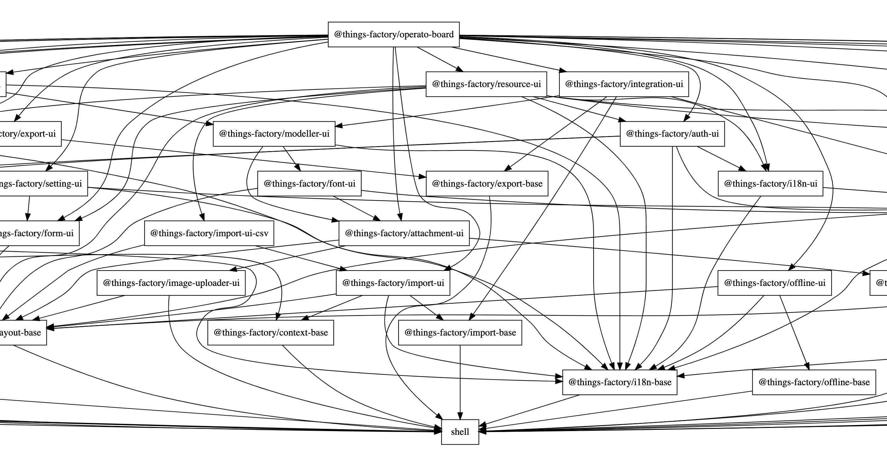

# Things-Factory Framework

Things-factory는

- 웹어플리케이션 개발을 지원
- 클라이언트 사이드와 서버 사이드의 모듈화 구조를 제공하여 높은 코드 재활용성을 지원
- PWA(Progressive Web Apps) 가이드라인을 따라 Mobile Ready 지원
- 도커 컨테이너 기반의 디플로이를 지원

하기위해서 [하티오랩](https://www.hatiolab.com)의 오너쉽 아래 개발 및 관리되는 프레임워크입니다.

## 개발 생산성 향상을 위한 프레임워크 구조

- 모듈화
  - 어플리케이션의 규모가 커질수록 많은 기능들은 서로의 종속성을 최소화하며 독립성을 유지해야 합니다. 이런 독립 기능들을 자유롭게 조립될 수 있는 모듈의 구조로 만들었습니다.
  - 종속성이 제거된 모듈은 어플리케이션에 쉽게 착탈될 수 있으며, 그에 따라 어플리케이션의 기능셋이 달라지게 됩니다.
  - 종속성을 최소화한 모듈은 여러 어플리케이션에서 재사용될 수 있습니다. 모듈이 재사용되면서 보완 및 검증된 기능은 이미 그 모듈을 사용하고 있는 어플리케이션의 품질을 향상시키게 됩니다.
  - 정의된 기능을 구성하는 서버와 클라이언트를 하나의 모듈 구성에 포함함으로서, 연관된 기능의 구현이 여러곳으로 파편화되는 것을 방지합니다. 또한 클라이언트와 서버사이드 모두 자바스크립트 언어를 사용하기때문에 업무 중심의 개발 오너쉽 관리에 도움이 됩니다.
    
- 기능 재정의 (오버라이드)
  - 어떤 모듈의 기능을 대부분 사용하면서, 일부분만은 재정의하고 싶을 때가 있습니다. 이 때에, 그 모듈을 직접 수정하지 않고, 그 모듈을 사용하는 쪽에서 일부분을 재정의 할 수 있다면, 그 모듈의 재사용율을 높일 수 있습니다.
  - 화면의 스타일, 테마, 이미지, 아이콘 등의 assets를 오버라이드 할 수 있습니다.
  - 다국어 및 도움말을 재정의 할 수 있습니다.
  - 어플리케이션 기본 설정(configuration)을 재정의할 수 있습니다.
  - API 구현을 재정의 할 수 있습니다.
- Progressive Web Apps (PWA)
  - 모바일 환경의 지원은 현대 어플리케이션이 지원해야할 중요한 특성입니다.
  - 모바일 환경에서는 웹브라우저에서 실행되는 웹어플리케이션보다는 모바일 앱의 형태가 사용성이 뛰어납니다.
  - 모바일에서 웹과 별도로 앱을 추가로 개발해야 한다면 매우 심각한 생산성 저하의 요인이 됩니다.
  - 모바일에서는 이미 개발된 웹 어플리케이션을 앱과 유사한 UX로 사용할 수 있도록 하는 모바일 웹기술이 PWA입니다.
  - 앱설치, 푸시 메시지 지원, 자동 버전업, 오프라인에서도 사용가능한 기능 등 앱과 유사한 UX가 PWA를 통해서 제공됩니다.
- 디플로이
  - 다양한 서버환경에 어플리케이션을 디플로이하는 문제는 매우 번거로운 일입니다.
  - 리눅스의 container 기능을 활용한 docker 기술로 일관성있고 안전한 디플로이가 가능하도록 Things Factory 프레임워크를 개발된 웹어플리케이션은 모두 docker 이미지 빌드를 지원합니다.

# Features

Things-Factory 프레임워크로 빌드된 어플리케이션은 다음과 같은 특징을 가지게 됩니다.

- Progressive Web Apps (PWA)
- 다국어 지원
- GraphQL API 지원
- Open API 지원
- JWT 기반 Authentication 지원
- Application 별 Theme Style 지원
- Multiple Tenancy 지원
- Inline 도움말(다국어) 기능

# Enabling Technologies

Things Factory 프레임워크를 위해서 다음과 같은 기술이 사용되었습니다.

- HTML 5, CSS 3, ECMA 6, typescript
- WebComponents
- node 방식의 package management (module plug & play)
- Mono repository
- Single Page Application
- Progressive Web Apps (PWA)
- Docker Container
- i18n (internationalization)
- openapi (slugger)
- webpack
- graphql
- ORM
