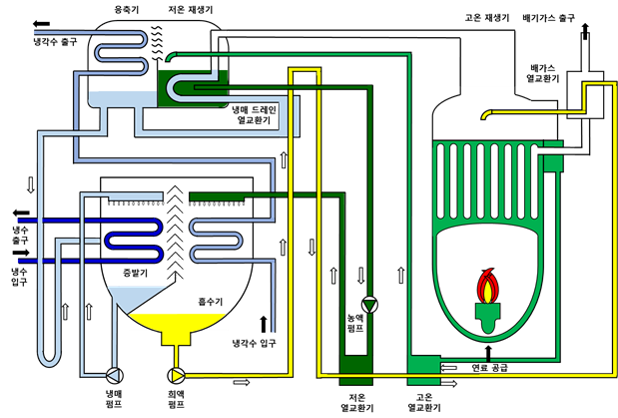

# Direct fired double effect absorption chiller

- Brief summary

Absorption heat pumps are machines that transfer thermal energy from a relatively low temperature to a high temperature by inputting heat or fuel.

- How it works

Since the boiling temperature of the fluid is proportional to the pressure, when high pressure and low pressure are formed in the cycle, heat can be transferred from the heat source of the low-pressure part to the heat source of the high-pressure part. The concentrated solution absorbs the refrigerant to form a low pressure in the evaporator, and the dilute solution discharges the refrigerant to form a high pressure in the condenser. The solution absorbs the refrigerant in the absorber and becomes a dilute solution, and in the generator, it becomes a concentrated solution by waste heat or gas combustion heat. Repetition of this process allows the refrigerant to flow and form low and high pressures. The refrigerant transfers heat by circulating the absorber, regenerator, condenser, and evaporator.

- Applications in STED platform
  - Absorption heat pumps can supply industrial process heat using low-temperature waste heat from the process.
  - In case that industrial process requires cold heat, vapor compression heat pumps can supply cold heat through the evaporator

---

**열량범위**  
: 1,000,000kcal/hr ~ 15,000,000kcal/hr

**가열온도**  
: ~ 1,500℃

**점화방식**  
: 파일럿 버너 점화 자가 점화

**화면감지**  
: 자외선 감지

**냉각방법**  
: 수냉식, 공냉식
