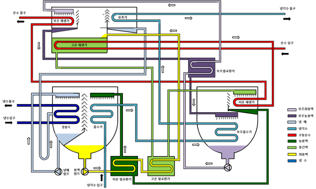

# 저온수 2단 흡수식 냉동기

- 개요

흡수식 히트펌프란 열이나 연료를 투입하여 열 에너지를 상대적으로 낮은 온도에서 높은 온도로 이송시키는 기계를 말한다.

- 작동원리

유체는 고압에서는 비등 온도가 높고, 저압에서는 비등 온도가 낮기 때문에 사이클 내에 고압과 저압을 형성하면 저압부의 열원에서 고압부의 열원으로 열을 이송시킬 수 있다. 농용액은 냉매를 흡수하여 증발기에 저압을 형성하며 주로 폐열이나 가스로 운전되는 재생기에 의해 희용액에서 빠져나온 냉매는 응축기에서 고압을 형성한다. 흡수용액은 흡수기와 재생기를 왕복하여 냉매가 저압과 고압을 형성하며 흐를 수 있도록 하고 냉매는 흡수기, 재생기, 응축기, 증발기를 반복해서 흐름으로써 열을 이송시킨다.

- STED 플랫폼에서 활용
  - 공정에서 발생되는 저온 폐열을 이용하여 산업에 활용될 수 있는 공정열을 공급할 수 있다.
  - 산업 공정 중 냉각이 필요한 경우 증발기 측과 연결하여 냉열을 공급할 수 있다.

---

**열량범위**  
: 1,000,000kcal/hr ~ 15,000,000kcal/hr

**가열온도**  
: ~ 1,500℃

**점화방식**  
: 파일럿 버너 점화 자가 점화

**화면감지**  
: 자외선 감지

**냉각방법**  
: 수냉식, 공냉식
