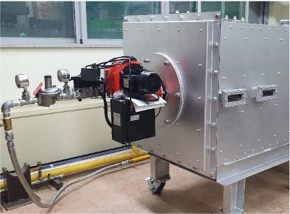
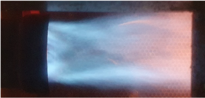

# 열풍용 연소기

- 개요

연료와 공기가 반응하여 열풍, 즉 고온의 배기가스를 발생시키는 장치이다. 최소 부하와 최대 부하의 비율인 부하의 변동범위(Turn-Down Ratio, TDR)가 높을 수록 넓은 범위의 열풍을 생성할 수 있다.

- 작동원리

버너는 다양한 조건(유량 및 온도)의 열풍을 형성하기위해 부하의 변동범위(TDR)가 높도록 작동한다. 연료는 높은 TDR이 가능한 구조의 제어 밸브를 통과하여 공급되고, 송풍기로 연소용 공기가 공급된다. 또한, 다양한 조건의 열풍을 형성하기위해 추가 공기가 공급되도록 할 수 있다. 높은 TDR 조건에서 보염 성능 및 화염의 안정화를 향상시키는 구조의 보염판을 통과하여 연료 노즐을 통해 분사된 연료와 혼합되고 화염을 형성한다. 배기 가스가 토출되며 열풍을 생성한다.

- STED 플랫폼에서 활용
  - LNG, LPG 등의 기체 연료를 이용하여 열풍을 생성한다.
  - 열풍용 연소기 설계에 활용될 수 있다.

---

**열량범위**  
: 1,000,000kcal/hr ~ 15,000,000kcal/hr

**가열온도**  
: ~ 1,500℃

**점화방식**  
: 파일럿 버너 점화 자가 점화

**화면감지**  
: 자외선 감지

**냉각방법**  
: 수냉식, 공냉식
