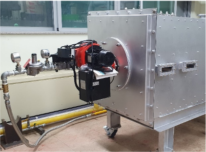
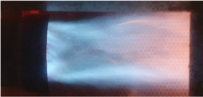

# Burner for Hot Gas Generation

- Brief summary

This device generates hot gas, that is hot exhaust gas by the chemical reaction of fuel and air. It is possible to generate wide variey of hot gases as Turn-dwon ratio(TDR), the ratio of the maximum capacity to minimum capacity, of the device is higher.

- How it works

This device operates at high TDR conditions to generate hot gases of various properties(flow rate, temperature). Fuel is precisely controller and supplied through high TDR control valve, and combustion air is supplied through blower. Additional air can be supplied to this device to get wider ranges of the hot gas. Air passes through a flame holder to increase flame holding and stability and mixes with fuel to generate flame, then hot gases are generated.

- Applications in STED platform
  - Hot gases are generated and can be supplied to dryer using gaseous fuels such as natural gas or propane gas.
  - This module can be used to desing a burner for hot gas generation.

---

**열량범위**  
: 1,000,000kcal/hr ~ 15,000,000kcal/hr

**가열온도**  
: ~ 1,500℃

**점화방식**  
: 파일럿 버너 점화 자가 점화

**화면감지**  
: 자외선 감지

**냉각방법**  
: 수냉식, 공냉식
