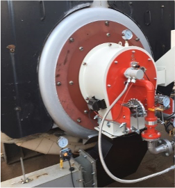

# 보일러용 연소기 - 중저체적 열부하형

- 개요
  연료와 공기가 반응하여 열을 발생시키는 장치이며 증기를 생산하는 스팀 보일러에 적용된다. 중저 체적열부하율(Volumetric Heat Release Rate)의 연소실 구조를 가진 중대형 보일러에 적합한 저녹스 연소 장치이다.

- 작동원리

버너는 중저 체적열부하율의 보일러 조건에서 질소산화물(NOx) 과 일산화탄소의 발생을 최소화 하기 위하여 확산 연소 형태로 작동한다. 연료와 공기가 각각 제어 밸브를 통과하여 일정량이 공급되면 저녹스버너(Low Nox Burner) 구조의 장치로 유입되어 분사된다. 저녹스를 위해 연료와 공기는 다단 구조가 가능하며 공기는 연료와의 혼합을 촉진하고 화염의 안정화를 향상시키기위해 보염판이나 선회기를 통과하여 연료 노즐을 통해 분사된 연료와 혼합되고 화염을 형성한다. 또한, NOx 저감 성능의 향상을 위해 배기 재순환 기술이 적용되어 배기 가스중 일부가 흡입 공기에 홉합되도록 하는 방식이 가능하다.

- STED 플랫폼에서 활용
  - LNG, LPG 등의 기체 연료를 이용하여 열을 발생, 보일러에 공급할 수 있다.
  - 보일러용 연소기 설계에 활용될 수 있다.

---

**열량범위**  
: 1,000,000kcal/hr ~ 15,000,000kcal/hr

**가열온도**  
: ~ 1,500℃

**점화방식**  
: 파일럿 버너 점화 자가 점화

**화면감지**  
: 자외선 감지

**냉각방법**  
: 수냉식, 공냉식
