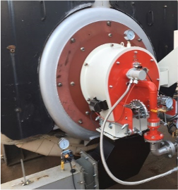
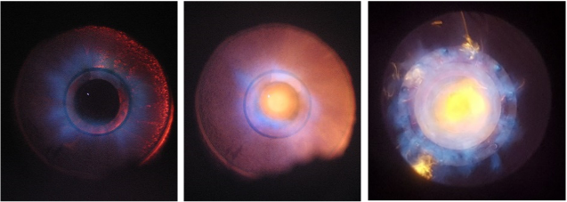

# Boiler Burner for Low-Medium Volumetric Heat Release Rate

- Brief summary

This device generates heat by the chemical reaction of fuel and air, and it is suitable to a medium to large capacity industrial boiler with low or medium volumetric heat release rate.

- How it works

This device operates in a diffusion combustion mode in order to minimize NOx and CO concentrations of exhaust gas in a boiler with medium to low volumetric heat release rate. Fuel and air controlled and supplied to a low Nox burner separately using control valves. It is possible to supply staged air and staged fuels, and air passes through flame holder or swirler to increase flame stability and promote mixing with fuels. In addition, it is possible to mix parts of exhaust gases to inlet air by adopting flue gas recirculation technique to furher decrease NOx concentrations.

- Applications in STED platform
  - Heat can be supplied to the boiler using gaseous fuels such as natural gas or propane gas.
  - This module can be used to desing a burner for steam boiler.

---

**열량범위**  
: 1,000,000kcal/hr ~ 15,000,000kcal/hr

**가열온도**  
: ~ 1,500℃

**점화방식**  
: 파일럿 버너 점화 자가 점화

**화면감지**  
: 자외선 감지

**냉각방법**  
: 수냉식, 공냉식
