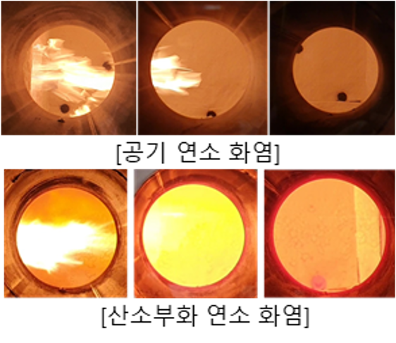

# High Temperature Oxygen-enriched combustor

- Brief summary

  It is a device that generates heat by supplying air/oxygen/fuel. It is possible to obtain a higher flame temperature compared to conventional air/fuel combustion by adding oxygen to the oxidizing agent for combustion. As a result, the heat utilization efficiency of the furnace is increased.

- How it works

  In order to burn a specific amount of fuel, an appropriate amount of oxygen must be supplied. When oxygen is added to air, the required amount of oxygen supplied from the air is reduced, and thus the amount of required air is also reduced. That means the amount of nitrogen, which makes up 80% of the air and does not participate in the combustion reaction, is reduced. As a result, the amount of heat required to raise the nitrogen temperature is reduced, which increases the flame temperature.

- Applications in STED platform
  - Heat can be supplied to the furnace by using fuel such as NG or propane.
  - The efficiency of the furnace can be increased by supplying flue gas with higher temperature to the furnace compared to conventional air/fuel combustion.

---

**열량범위**  
: 1,000,000kcal/hr ~ 15,000,000kcal/hr

**가열온도**  
: ~ 1,500℃

**점화방식**  
: 파일럿 버너 점화 자가 점화

**화면감지**  
: 자외선 감지

**냉각방법**  
: 수냉식, 공냉식
