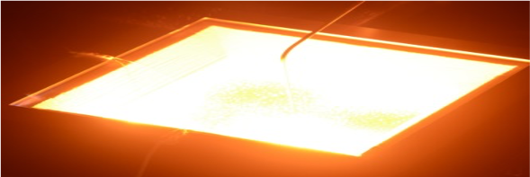
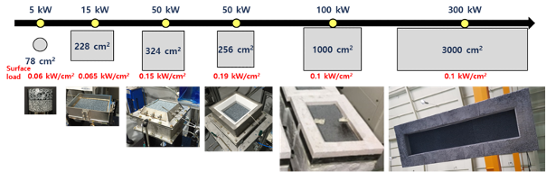

# 균일가열형 다공체 연소기

- 개요

  공기/연료를 공급하여 열을 발생시키는 장치이다. 빈 공간에 화염이 형성되는 일반 연소기와 달리, 다공체 연소기에서는 세라믹 재질의 다공체 내부에 화염이 위치한다. 배가스 열이 다공체를 통해 재순환되어 화염 안정화 조건이 넓어지는 특징을 가진다.

- 작동원리

  연소 배가스가 화염 하류의 다공체를 가열하고, 온도가 높아진 하류의 다공체로부터 상류 방향으로 열전도가 발생한다. 열전도에 의해 온도가 상승한 화염 상류의 다공체에 의해 공기/연료 혼합기가 예열되어 화염온도가 상승하게 된다. 즉, 다공체가 recuperator 역할을 하는 것이다. 화염을 다공체 내부에 위치시키기 위해서는 단계적인 운전 절차가 필요하다. 우선 적절한 당량비 조건으로 화염을 다공체 표면에 위치시킨 후, 완전연소 조건 방향으로 점차 변화시키거나 평균유속을 줄여 장시간 기다리면 화염이 다공체 내부에 위치하게 된다.

- STED 플랫폼에서 활용
  - NG, 프로판 등의 연료를 이용하여 가열로에 열을 공급할 수 있다.
  - 고온의 다공체로부터 발생하는 강한 복사에너지에 의해 연소열 대비 피열물로의 열전달률이 증가한다. 결과적으로 가열로에 적용 시 가열로 효율을 높일 수 있다.

---

**열량범위**  
: 1,000,000kcal/hr ~ 15,000,000kcal/hr

**가열온도**  
: ~ 1,500℃

**점화방식**  
: 파일럿 버너 점화 자가 점화

**화면감지**  
: 자외선 감지

**냉각방법**  
: 수냉식, 공냉식
