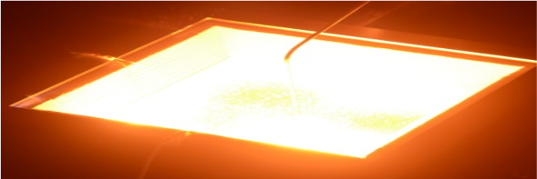
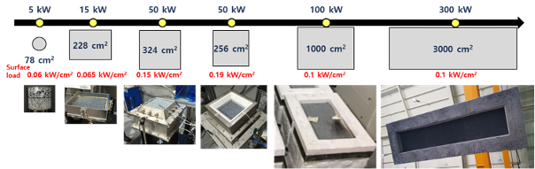

# Uniform heating porous medium combustor

- Brief summary

  It is a device that generates heat by supplying air/oxygen/fuel. In a porous media combustor, a flame is located inside the porous media made of ceramic material, while the flame is formed in an empty space in a conventional combustor. The heat of the flue gas is recirculated through the porous media and thus flame stabilization conditions are widened.

- How it works

  The combustion flue gas heats the porous media downstream of the flame, and the heat is conducted to the upstream of the porous media which preheats air/fuel mixture. The final flame temperature increases because of higher temperature of inlet premixture. That is, the porous body acts as a recuperator. To place the flame inside the porous media, a step-by-step operation procedure is required. First, the flame is placed on the surface of the porous media under an appropriate equivalence ratio condition, and then the flame is pushed into inside of the porous media by gradually adjusting the equivalence ratio higher or the mixture flow rate lower.

- Applications in STED platform
  - Heat can be supplied to the furnace by using fuel such as NG or propane.
  - The ratio of heat transfer to the slab over the combustion energy is increased by the radiant heat flux generated from the high-temperature porous media. As a result, it is possible to increase the furnace efficiency.

---

**열량범위**  
: 1,000,000kcal/hr ~ 15,000,000kcal/hr

**가열온도**  
: ~ 1,500℃

**점화방식**  
: 파일럿 버너 점화 자가 점화

**화면감지**  
: 자외선 감지

**냉각방법**  
: 수냉식, 공냉식
