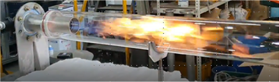
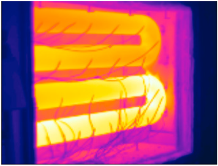

# 균일온도형 복사관 연소기

- 개요

공기/연료를 공급하여 열을 발생시키는 장치이다. 이 연소열은 복사관을 가열하고, 가열된 복사관으로부터 발생한 복사열이 피열물을 간접적으로 가열하게 된다. 연소 배가스는 피열물과 접촉하지 않아, 연소로 내 분위기 가스의 농도 제어와 연소로 내 온도 균일화에 유리하다.

- 작동원리

피열물을 균일한 온도로 가열하기 위해서는 복사관 표면온도의 균일화가 중요하다. 이를 위해서는 복사관 길이 방향으로 멀리까지 열이 전달되도록 화염을 길게 제어하는 것이 중요하다. 화염이 긴 경우 국부적으로 화염온도가 높은 영역이 발생하게 되어 NOx 농도가 높아지는 경향이 있는데, 환경규제를 맞추기 위해서는 NOx 제어기술이 중요하게 된다.

- STED 플랫폼에서 활용
  - NG, 프로판 등의 연료를 이용하여 가열로에 열을 간접적으로 공급할 수 있다.
  - 연소 배가스는 가열로 내부가 아닌 외부로 배출되며, 연소열만 가열로로 공급된다.

---

**열량범위**  
: 1,000,000kcal/hr ~ 15,000,000kcal/hr

**가열온도**  
: ~ 1,500℃

**점화방식**  
: 파일럿 버너 점화 자가 점화

**화면감지**  
: 자외선 감지

**냉각방법**  
: 수냉식, 공냉식
