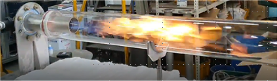
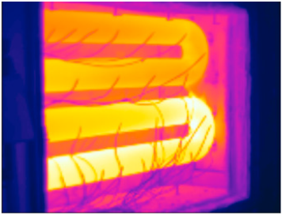

# Uniform Temperature Radiant tube combustor

- Brief summary

  It is a device that generates heat by supplying air/oxygen/fuel. This combustion energy heats up the radiation tube, and the radiant energy generated from the heated radiation tube indirectly heats up the slab. Since the exhaust gas does not come into contact with the slab, it is advantageous to control the concentration of atmospheric gas and temperature uniformity in the combustion furnace.

- How it works

  In order to heat the slab with temperature uniformity, it is important to control the surface temperature of the radiation tube uniformly. To this end, it is important to control the flame to be long so that heat is transferred farther along the length of the radiation tube. But as the flame gets long, a locally high-temperature zone is generated and the NOx concentration tends to increase. In order to meet environmental regulations, NOx control technology becomes important.

- Applications in STED platform
  - Heat can be supplied indirectly to the furnace by using fuel such as NG or propane.
  - Combustion flue gas is discharged to the outside not the inside of the furnace, and only combustion energy is transferred to the furnace.

---

**열량범위**  
: 1,000,000kcal/hr ~ 15,000,000kcal/hr

**가열온도**  
: ~ 1,500℃

**점화방식**  
: 파일럿 버너 점화 자가 점화

**화면감지**  
: 자외선 감지

**냉각방법**  
: 수냉식, 공냉식
