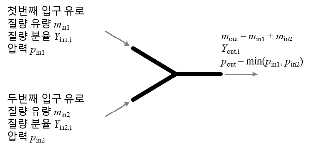

# Fluid mixer

- Brief summary

Fluid splitter is a device that divides the fluid entering the inlet into two and discharges it to the outlet.

- How it works

The amount of fluid discharged to the two outlets is adjusted according to the distribution rate input by the user. If the distribution ratio is 100%, all the fluid is discharged through the first outlet passage. The pressure drop occurring in the distributor can be entered by the user. Professional analysis is required to predict the pressure drop according to the design of the distributor and the diameter of the pipe.

- Applications in STED platform

One fluid can be split in two and fed to two different devices.

---

**열량범위**  
: 1,000,000kcal/hr ~ 15,000,000kcal/hr

**가열온도**  
: ~ 1,500℃

**점화방식**  
: 파일럿 버너 점화 자가 점화

**화면감지**  
: 자외선 감지

**냉각방법**  
: 수냉식, 공냉식
