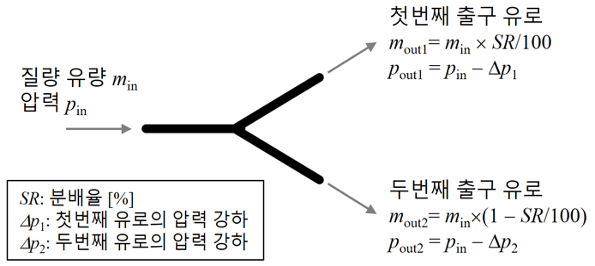

# 유체 분배기

- 개요

유체 분배기란 입구로 들어온 유체를 둘로 나누어 출구로 내보내는 기기를 말합니다.

- 작동원리

사용자가 입력하는 분배율에 따라 두 개의 출구로 배출되는 유체의 양이 조절됩니다. 분배율이 100%이면 첫번째 출구 유로를 통해 모든 유체가 빠져 나가고, 분배율이 0%이면 두번째 출구 유로를 통해 모두 빠져 나갑니다.
분배기 내에서 발생하는 압력 강하를 사용자가 입력할 수 있습니다. 압력 강하는 분배기의 설계 및 운전 조건 등에 따라 크게 달라지므로 정확한 예측을 하기 위해서는 전문적인 분석이 필요합니다.

- STED 플랫폼에서 활용

하나의 유체를 둘로 나누어 서로 다른 두 기기에 공급할 수 있습니다.

---

**열량범위**  
: 1,000,000kcal/hr ~ 15,000,000kcal/hr

**가열온도**  
: ~ 1,500℃

**점화방식**  
: 파일럿 버너 점화 자가 점화

**화면감지**  
: 자외선 감지

**냉각방법**  
: 수냉식, 공냉식
