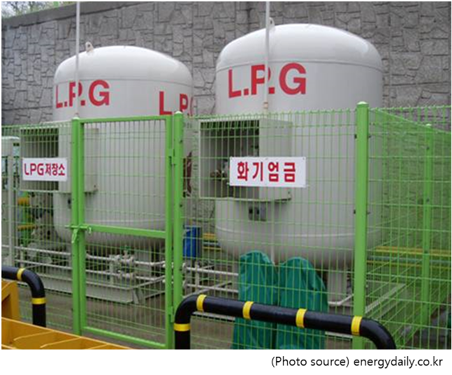

# 액화천연가스

- 개요

설비에 액화석유가스(LPG)를 공급하는 경우 이 모듈을 사용하십시오.

- STED 플랫폼에서 활용

LPG의 조성과 온도, 압력 및 유량을 사용자가 지정할 수 있습니다. 또는 사용자가 설계한 설비가 주어진 조건(목표치)를 만족하기 위해 필요한 LPG의 유량을 Level 1 해석을 통해 결정할 수 있습니다.

- 유의사항

LPG의 주성분은 일반적으로 가정용은 프로판, 자동차 연료용은 부탄를 주연료로 하며, 계절과 용도에 따라 그 혼합비를 조절합니다. 따라서 정확한 조성은 공급처에 문의하시기 바라며, KS 표준(KS M 2150)에 따른 LPG의 조성과 주요 용도는 표를 참고하십시오.

---

**열량범위**  
: 1,000,000kcal/hr ~ 15,000,000kcal/hr

**가열온도**  
: ~ 1,500℃

**점화방식**  
: 파일럿 버너 점화 자가 점화

**화면감지**  
: 자외선 감지

**냉각방법**  
: 수냉식, 공냉식
