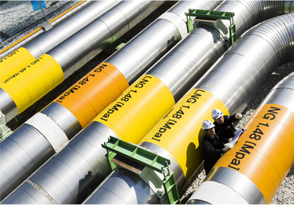

# Natural gas

- Brief summary

Use this module in case that natural gas is supplied to a user-designed facility.

- Applications in STED platform

User can specify composition, temperature, pressure and flow rate of natural gas. Or the flow rate, that is required to meet the user-specifying condition (target) of facility, can be determined through the Level 1 analysis.

---

**열량범위**  
: 1,000,000kcal/hr ~ 15,000,000kcal/hr

**가열온도**  
: ~ 1,500℃

**점화방식**  
: 파일럿 버너 점화 자가 점화

**화면감지**  
: 자외선 감지

**냉각방법**  
: 수냉식, 공냉식
