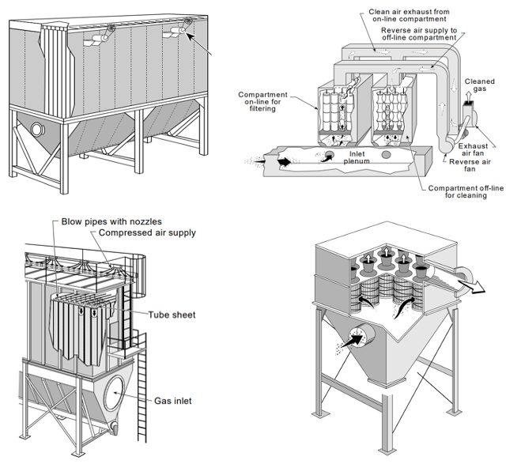

# 집진기

- 개요
  - 백필터란 주로 산업 설비의 배기가스 중의 먼지를 집진하기 위해 사용되는 여과식 집진기를 의미
  - 여과포 선택에 의해 폭넓은 범위의 온도나 배기가스에 대응 가능
  - 사이클론으로 포집할 수 없는 서브미크론 이하의 입자도 포집할 수 있는 장점 보유
- 작동 원리
  - 여과포의 구멍을 통해 가스는 통과하고 고형 분진은 여러개의 여과포에 포집
  - 포집된 고형 분진은 Pulsing Air에 의해 백필터 하부에 모인 후 장치 외부로 배출
  - Pulsing Air에 의해 분진이 제거된 여과포는 분진 포집에 재사용
- STED 플랫폼에서 활용
  - 공정 가스에 함유된 싸이클론으로 분리하기 힘든 미세 고형 분진의 제거에 사용

---

**열량범위**  
: 1,000,000kcal/hr ~ 15,000,000kcal/hr

**가열온도**  
: ~ 1,500℃

**점화방식**  
: 파일럿 버너 점화 자가 점화

**화면감지**  
: 자외선 감지

**냉각방법**  
: 수냉식, 공냉식
