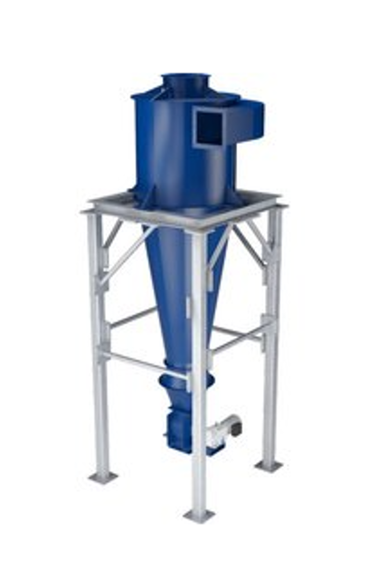

# 싸이클론

- 개요
  싸이클론 집진장치는 가스가 회전하면서 발생되는 원심력을 이용하여 기체속에 포함된 미립자를 포집하여 제거하는 장치이다.

- 작동 원리
  원리는 고체 또는 액체상태의 먼지를 가스로부터 분리시키기 위해 가스를 회전시키고 이 때 발생되는 원심력을 이용한다. 함진 가스가 나선형으로 이동하면서 입자는 둘레 부분의 벽으로 이동한 다음 바닥으로 침전하는 과정을 거친다. 이후 청정 가스는 상향 나선형 운동을 하며 출구 내경을 통해 배출된다.

- STED 플랫폼에서 활용
  유입되는 가스에서 입자를 제거하고 싶은 경우 사용된다.

---

**열량범위**  
: 1,000,000kcal/hr ~ 15,000,000kcal/hr

**가열온도**  
: ~ 1,500℃

**점화방식**  
: 파일럿 버너 점화 자가 점화

**화면감지**  
: 자외선 감지

**냉각방법**  
: 수냉식, 공냉식
