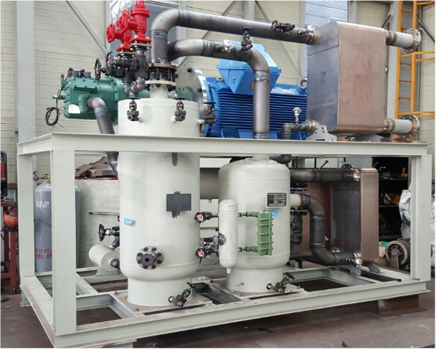

# 증기압축식 히트펌프

- 개요

압축식 히트펌프란 외부의 유용한 일을 투입하여 열을 상대적으로 낮은 온도에서 높은 온도로 퍼 올리는 기계를 말한다.

- 작동원리

유체는 고압에서는 비등 온도가 높고, 저압에서는 비등 온도가 낮기 때문에 저압 비등점보다 높은 온도에서 유체를 증발시키면 외부의 열을 흡수하면서 유체가 기체상이 되고, 이 증발된 기체를 압축하여 고압으로 만든 후 고압 비등점보다 낮은 온도에서 응축을 시키면 히트펌프 내부 유체가 외부에 열을 방출하면서 기체 상태가 액체가 된다. 다시 고압의 응축 액체를 저압으로 팽창시킨 후 다시 증발을 시키는 과정을 반복함으로서 히트펌프는 외부의 저온 열을 고온 열로 퍼 올릴 수 있는 것이다.

- STED 플랫폼에서 활용
  - 공정에서 발생되는 저온 폐열을 이용하여 산업에 활용될 수 있는 공정열을 공급할 수 있다.
  - 산업 공정 중 냉각이 필요한 경우 증발기 측과 연결하여 냉열을 공급할 수 있다.

---

**열량범위**  
: 1,000,000kcal/hr ~ 15,000,000kcal/hr

**가열온도**  
: ~ 1,500℃

**점화방식**  
: 파일럿 버너 점화 자가 점화

**화면감지**  
: 자외선 감지

**냉각방법**  
: 수냉식, 공냉식
