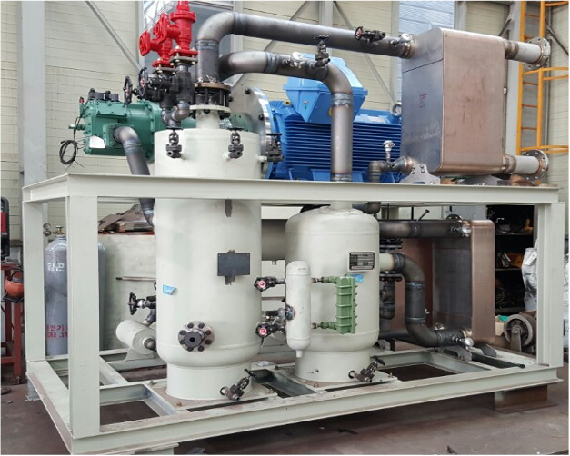

# Vapor compression heat pump

- Brief summary

Vapor compression heat pumps are the machines that can transfer heat from low-temperature reservoirs to high-temperature reservoirs using external mechanical work.

- How it works

A fluid in high pressure has a high boiling temperature than in low pressure. Thus, the fluid can be evaporated where the boiling temperature of the fluid in low pressure is lower than the environment temperature, and the fluid becomes a gas state by absorbing heat from the environment. Through compression process, both temperature and pressure of the gas increase. Then it can be condensed where environment temperature is lower than the boiling temperature of the high-pressure gas, and the fluid becomes a liquid state by releasing heat into the environment. Through expansion process, the high pressure liquid returns to the low pressure state, and the fluid can be evaporated again. By repeating these processes, a vapor compression heat pump can deliver heat from low temperature to high-temperature environments.

- Applications in STED platform
  - Vapor compression heat pumps can supply industrial process heat using low-temperature waste heat from the process.
  - In case that industrial process requires cold heat, vapor compression heat pumps can supply cold heat through the evaporator

---

**열량범위**  
: 1,000,000kcal/hr ~ 15,000,000kcal/hr

**가열온도**  
: ~ 1,500℃

**점화방식**  
: 파일럿 버너 점화 자가 점화

**화면감지**  
: 자외선 감지

**냉각방법**  
: 수냉식, 공냉식
