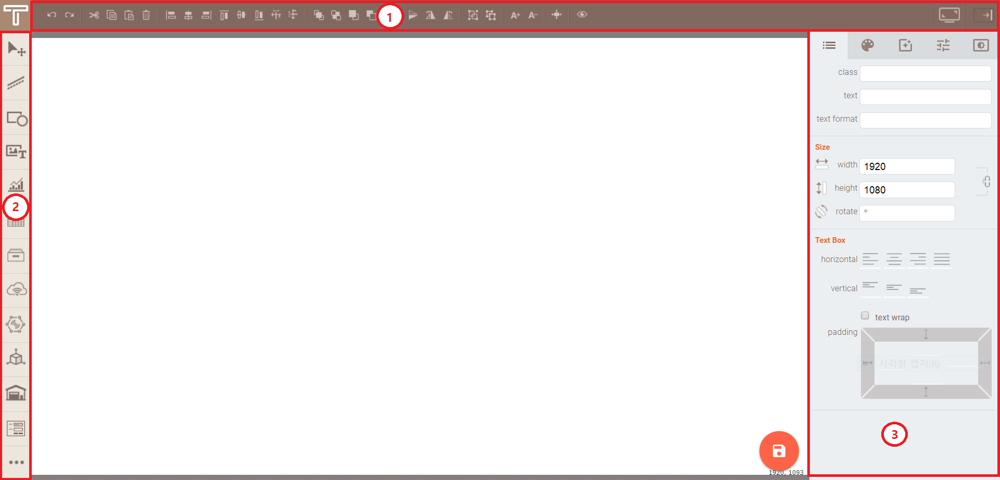

# Board Modeller

## Layout
It describes about the layout of modeler.

1. Control Toolbar: The toolbar in which has concentrated the function of controlling the component like return, copy, sort, reverse, etc.

1. Component toolbar: The toolbar in which has concentrated the component of being used in modeler.

1. Property window: The window in which has concentrated the property of component.

## Toolbar

A tool bar that lists the information on the SCENE currently being modeled and the functions needed to make modeling easier.  
  (If your OS is a Mac, type <kbd class="dark">⌘</kbd> in place of <kbd>Ctrl</kbd> key.) 

1. Undo![Undo][Undo](<kbd>Ctrl</kbd> + <kbd>Z</kbd>) :  
  The function to undo the last edited content.

1. Redo![Redo][Redo](<kbd>Ctrl</kbd> + <kbd>Shift</kbd> + <kbd>Z</kbd>) :  
  Redo the contents of the operation undone.

1. Cut![Cut][Cut](<kbd>Ctrl</kbd> + <kbd>X</kbd>) :  
  Delete the current component while copying the selected component to the clipboard.

1. Copy![Copy][Copy](<kbd>Ctrl</kbd> + <kbd>C</kbd>) :  
  Copy the selected component to the clipboard.

1. Paste![Paste][Paste](<kbd>Ctrl</kbd> + <kbd>V</kbd>) :  
  Paste the copied component to the clipboard.

1. Delete![Delete][Delete](<kbd>Delete</kbd> or <kbd>Backspace</kbd>) :  
  Delete the selected component.

1. Align left![Align left][Align left](<kbd>Alt</kbd> + <kbd>Shift</kbd> + <kbd>L</kbd>) :  
  Align the components to the left based on the leftmost component of the selected components.

1. Align center![Align center][Align center](<kbd>Alt</kbd> + <kbd>Shift</kbd> + <kbd>C</kbd>) :  
  Align X-coordinate of components center based on the center coordinate of the selected components.

1. Align right![Align right][Align right](<kbd>Alt</kbd> + <kbd>Shift</kbd> + <kbd>R</kbd>) :  
  Align the components to the right based on the rightmost component of the selected components.

1. Align top![Align top][Align top](<kbd>Alt</kbd> + <kbd>Shift</kbd> + <kbd>T</kbd>) :  
  Align the components to the top based on the topmost component of the selected components.

1. Align center![Align center][Align center](<kbd>Alt</kbd> + <kbd>Shift</kbd> + <kbd>M</kbd>) :  
  Align Y-coordinate of components center based on the center coordinate of the selected components.

1. Align bottom![Align bottom][Align bottom](<kbd>Alt</kbd> + <kbd>Shift</kbd> + <kbd>B</kbd>) :  
  Align the components to the bottom based on the bottommost component of the selected components.

1. Distribute horizontally![Distribute horizontally][Distribute horizontally](<kbd>Alt</kbd> + <kbd>Shift</kbd> + <kbd>H</kbd>) :  
  Adjusts the width between components to be the same based on the components at both ends of the selected components in the horizontal direction.

1. Distribute vertically![Distribute vertically][Distribute vertically](<kbd>Alt</kbd> + <kbd>Shift</kbd> + <kbd>V</kbd>) :  
  Adjusts the height between components to be the same based on the components at both ends of the selected components in the vertical direction.

1. Bring to front![Bring to front][Bring to front](<kbd>Ctrl</kbd> + <kbd>Shift</kbd> + <kbd>F</kbd>) :  
  Move the selected component in front of all other components.

1. Send to back![Send to back][Send to back](<kbd>Ctrl</kbd> + <kbd>Shift</kbd> + <kbd>B</kbd>) :  
  Move the selected component behind all other components.

1. Bring forward![Bring forward][Bring forward](<kbd>Ctrl</kbd> + <kbd>F</kbd>) :  
  Move the selected component one layer forward.

1. Send backward![Send backward][Send backward](<kbd>Ctrl</kbd> + <kbd>B</kbd>) :  
  Move the selected component one layer back.

1. Mirror horizontally![Mirror horizontally][Mirror horizontally](<kbd>Alt</kbd> + <kbd>Shift</kbd> + <kbd>X</kbd>) :   Mirror the selected component horizontally.

1. Mirror vertically![Mirror vertically][Mirror vertically](<kbd>Alt</kbd> + <kbd>Shift</kbd> + <kbd>Y</kbd>) :  
  Mirror the selected component vertically.

1. Rotate clockwise![Rotate clockwise][Rotate clockwise](<kbd>Alt</kbd> + <kbd>Shift</kbd> + <kbd>E</kbd>) :  
  Rotate the selected component 90 degrees clockwise.

1. Rotate counterclockwise![Rotate counterclockwise][Rotate counterclockwise](<kbd>Alt</kbd> + <kbd>Shift</kbd> + <kbd>W</kbd>) :  
  Rotate the selected component 90 degrees counterclockwise.

1. Group![Group][Group](<kbd>Ctrl</kbd> + <kbd>G</kbd>) :  
  Group the selected components.

1. Ungroup![Ungroup][Ungroup](<kbd>Ctrl</kbd> + <kbd>Shift</kbd> + <kbd>G</kbd>) :  
  Ungroup the selected group.

1. Increase text size![Increase text size][Increase text size](<kbd>Shift</kbd> + <kbd>WheelUp</kbd>) :  
  Increase the text size of the selected component.

1. Decrease text size![Decrease text size][Decrease text size](<kbd>Shift</kbd> + <kbd>WheelDown</kbd>) :  
  Decrease the text size of the selected component.

1. Fit scene![Fit scene][Fit scene](<kbd>Ctrl</kbd> + <kbd>D</kbd>) :  
  Fit the size of the canvas just to the screen.

1. Preview![Preview][Preview](<kbd>Ctrl</kbd> + <kbd>P</kbd>) :  
  Preview 3D components, animations, and other effects on the modeling screen you're editing.    

1. Full screen![Full screen][Full screen](<kbd>F11</kbd>) :  
  Hide all toolbars and property windows, and convert the modeling screen to full screen.

1. Toggle property panel![Toggle property panel][Toggle property panel](<kbd>Ctrl</kbd> + <kbd>H</kbd>) :  
  Hide or show property windows.

[control-toolbar]: ./images/control-toolbar.png#control-toolbar
[Undo]: ./images/control-toolbar-02.png
[Redo]: ./images/control-toolbar-03.png
[Cut]: ./images/control-toolbar-04.png
[Copy]: ./images/control-toolbar-05.png
[Paste]: ./images/control-toolbar-06.png
[Delete]: ./images/control-toolbar-07.png
[Copy style]: ./images/control-toolbar-08.png
[Align left]: ./images/control-toolbar-09.png
[Align center]: ./images/control-toolbar-10.png
[Align right]: ./images/control-toolbar-11.png
[Align top]: ./images/control-toolbar-12.png
[Align center]: ./images/control-toolbar-13.png
[Align bottom]: ./images/control-toolbar-14.png
[Distribute horizontally]: ./images/control-toolbar-15.png
[Distribute vertically]: ./images/control-toolbar-16.png
[Bring to front]: ./images/control-toolbar-17.png
[Send to back]: ./images/control-toolbar-18.png
[Bring forward]: ./images/control-toolbar-19.png
[Send backward]: ./images/control-toolbar-20.png
[Mirror horizontally]: ./images/control-toolbar-21.png
[Mirror vertically]: ./images/control-toolbar-22.png
[Rotate clockwise]: ./images/control-toolbar-23.png
[Rotate counterclockwise]: ./images/control-toolbar-24.png
[Group]: ./images/control-toolbar-25.png
[Ungroup]: ./images/control-toolbar-26.png
[Increase text size]: ./images/control-toolbar-27.png
[Decrease text size]: ./images/control-toolbar-28.png
[Fit scene]: ./images/control-toolbar-29.png
[Preview]: ./images/control-toolbar-32.png
[Full screen]: ./images/control-toolbar-30.png
[Toggle property panel]: ./images/control-toolbar-31.png

## Component Toolbar

The toolbar in which has concentrated the component being used in the modeler. If click the required component in the component toolbar, the corresponding component will be added to the modeler.  

- ![arrow][component-arrow] : Change the selection mode and shift mode. It will operate as shift mode during pressing <kbd>Space</kbd>.

- ![line][component-line] : Contain line components

- ![shape][component-shape] : Contain shape components

- ![text media][component-text-media] : Contain text and media components

- ![chart gauge][component-chart-gauge] : Contain chart and gauge components

- ![table][component-table] : Contain table components

- ![container][component-container] : Contain container components.

- ![datasource][component-datasource] : Contain datasource components#datasource-component).

- ![IOT][component-iot] : Contain IOT component

- ![3D][component-3D] : Contain 3D component

- ![warehouse][component-warehouse] : Contain warehouse components.

- ![form][component-form] : Contain form components

- ![etc][component-etc] : Contain other components

[component-toolbar]: ./images/component-toolbar.png
[component-arrow]: ./images/component-arrow.png
[component-line]: ./images/component-line.png
[component-shape]: ./images/component-shape.png
[component-text-media]: ./images/component-text-media.png
[component-chart-gauge]: ./images/component-chart-gauge.png
[component-table]: ./images/component-table.png
[component-container]: ./images/component-container.png
[component-datasource]: ./images/component-datasource.png
[component-iot]: ./images/component-iot.png
[component-3D]: ./images/component-3D.png
[component-warehouse]: ./images/component-warehouse.png
[component-form]: ./images/component-form.png
[component-etc]: ./images/component-etc.png

## Property Window

It describes about the functions of property window.  

1. ![shape property tab][shape-property-tab]: The property related to the shape of component. You can assign ID, class or specify the width, height, etc.

1. ![style property tab][style-property-tab]: You can specify the property, color, font related to the style of component.

1. ![effect property tab][effect-property-tab]: The property related to the effect of component. You can specify the shadow, animation, click event.

1. ![specific property tab][specific-property-tab]: The specific property of component.

1. ![variable property tab][variable-property-tab]: The property related to the data of Scene.

[property-window]: ./images/property-window.png
[shape-property-tab]: ./images/shape-property.png
[style-property-tab]: ./images/style-property.png
[effect-property-tab]: ./images/effect-property.png
[specific-property-tab]: ./images/specific-property.png
[variable-property-tab]: ./images/variable-property.png
